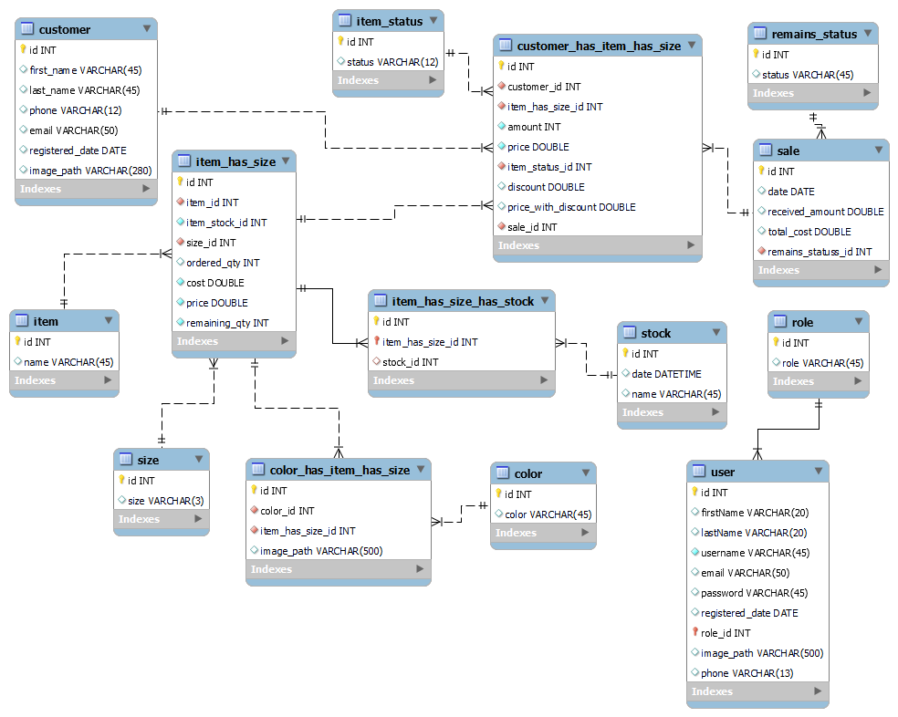

# Inventory Management System With Integrated POS features

This repository contains the source code for the application which is built for a fashion store 
to manage their inventory, users and integrated some POS features to handle checkout operations.

# 📚 Table of contents
- Project Overview
- Key User Roles
- Tech Stack
- Features (In progress)

# 📁 Project Overview

- **Type**: Desktop Application
- **Purpose**: Manage inventory, suppliers, and sales operations through a local POS interface
- **Status**: In Development

# 🧑‍💼 Key User Roles
- Cashier
- Customer
- Admin

# 🛠️ Tech Stack
- Java SE 17
- JavaFX 17.0.2
- Gradle Build tool
- MySQL DBMS

## 🧩 Database Design

### 🗺️ Database Name
    sandyafashioncorner
### 🗺️ ER Diagram



# ✅ Features (In Progress)

- Checkout
  - Add items by item number
  - Add discount separately for each item
  - Add discount to all items added for checkout
  - Calculate due balance (funds received - total cost of items)
  - Remove items added to check out list
  - Accept items returned
  - Select Items to be added to check out list


- Inventory Management
  - Add, Delete Products
  - Update Products
  - View Product Information
  - Create new stocks
  - Get stock data
  - Generate stock, inventory and sales reports


# 📂 Folder Structure

```
├── src/
|   └─  main/
|       └─java/
|         └─ com/
|            └─ example/
|               └─ inventorymanagementsysetm/
|                  ├─ controllers/     # controllers for UIs
|                  ├─        dialogs/       # controllers for custom dialog boxes
|                  ├─        # contains main UI controllers
|                  ├─ db/      # classes related to database involved tasks
|                  ├─ models/  # data structures (Data objects) that represents tables in the database
|                  ├─ state/   # sharable data (ex. application constants used in many classes)
|                  └─ view/    # Java classes for UIs
|                           components/    # Java classes for custom components
|                           dialogs/       # Java classes for dialogs created
|                 
|       resources/       #contains resources used by application (ex. images, stylesheets, fxml files)
|       └─ com/
|          └─ example/
|                   inventorymanagementsystem/
|                   ├─ css/ # contains css files
|                   ├─ dialogs/ # contains fxml files belongs to custom dialog boxes
|                   ├─ AdministratorUI.fxml    # UI for Administrator tab (This UI is used by the admin)
|                   ├─ ApplicationUI.fxml      # Main application window
|                   └─ CheckoutUI.fxml         # UI for Checkout tab (This UI is used by the cashier)
|
├─ .gitignore
└─ README.md
```


# 📌 Notes
- This project is not yet packaged for production.
- You need to install MySQL on your machine and create the database by following the ER diagram shown above
